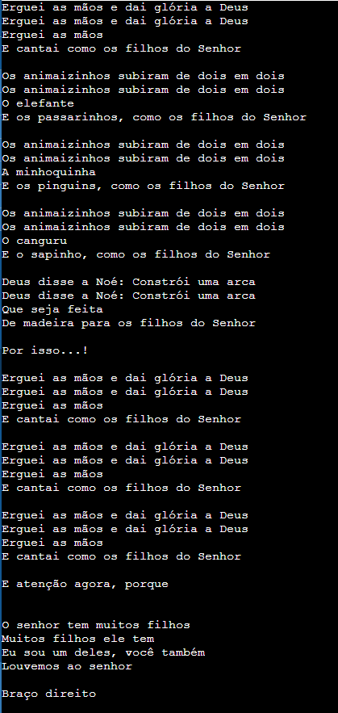

# Desafio-ZG

## Desafio da Música Erguei As Mãos

## Descrição
É um programa feito em python que imprime a letra da música no terminal.

## Tecnologia Utilizada:
|Python|
|-|
||

## Melhorias:

- desenvolver melhor o codigo, um POO(orientação a objeto poderia ajudar pelo fator de ter termos repetitivos);

- adicionar alguma biblioteca que emita som para que a musica possa ser tocada e deixe mais dinamico a experiencia do usuario com o programa;

